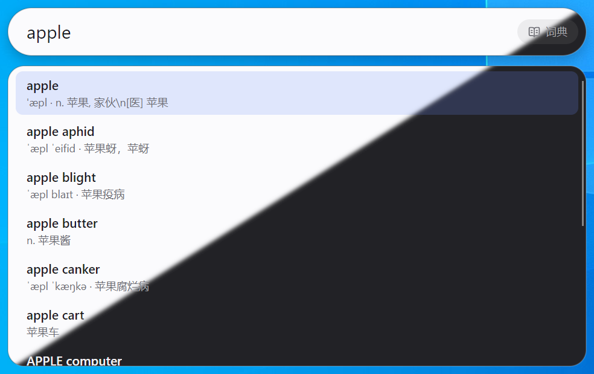

Read this in other languages: **简体中文**, [English](README.en-US.md)

<br>
<div align="center">
  
</div>
<br>

# 酥脆搜索（Crispy Searchbar）

一款轻量、现代、快速的 Windows 全局搜索框。使用 C# 与 Avalonia UI 构建，以响应迅速、后台低占用、搜索模式分离为设计目标。

此项目**没有**制作任何整合搜索或全量搜索模式的打算，而是致力于为有确定搜索或查询意图、不愿意被无关搜索结果干扰的用户打造。

## 功能特色

<br>
<div align="center">
  
</div>
<br>

- **快速呼出**：常驻于系统托盘，按下快捷键（默认为 Alt + 空格键）即可呼出搜索框。
- **开机自启**：可在设置中启用登录 Windows 后自动启动，并静默驻留系统托盘。
- **全屏免打扰**：默认在前台应用全屏时不响应全局快捷键，避免打断游戏或视频；托盘点击仍可随时呼出。
- **模式切换**：短按模式切换键（默认为 Tab）快速切换到下一搜索模式（保留输入内容）；长按模式切换键呼出模式选择轮盘，并可以用 ↑、↓ 键或鼠标滚轮进行切换。
- **模式自定义**：用户可随时在配置设置面板中启用或禁用任意搜索模式，并可对各个模式在切换轮盘中的位置进行拖拽排序。
- **位置可调**：搜索框默认出现在主显示器中央，可在设置面板中按像素微调位置偏移，并随时一键恢复默认位置；搜索框靠近屏幕底部时候选与模式轮盘会自动改为向上弹出。
- **跟随系统主题**：支持浅色/深色模式，并可根据系统主题自动跟随切换。

## 支持搜索模式

- **网页搜索**：使用预先配置的搜索引擎在默认浏览器中搜索输入的内容，支持[百度](https://www.baidu.com)、[谷歌](https://www.google.com/)和[必应](https://www.bing.com/)。
- **维基百科**：在 [维基百科](https://zh.wikipedia.org/) 中查询输入的内容，所使用的维基百科语种将随界面语言自动切换。
- **询问 Deepseek**：使用默认浏览器，在 [DeepSeek 网页版](https://chat.deepseek.com/) 中询问输入的问题。需要用户拥有 DeepSeek 账户并提前在浏览器中登录。
- **词典**：支持英汉和汉英词汇查询，随输入实时显示候选词。使用 [CC-CEDICT](https://www.mdbg.net/chinese/dictionary?page=cedict)（汉 → 英）与 [ECDICT](https://github.com/skywind3000/ECDICT)（英 → 汉）进行离线查询。离线词典数据随程序本体一同分发（单文件发布时内嵌在 exe 内），无需另外下载，也不需要任何外附数据文件。两个方向支持同一组自备词典格式：`.txt`（CC-CEDICT 文本，或每行“词头 + 制表符 + 释义”的通用文本）、`.csv`、`.gz`/`.zip` 压缩文件，以及 [StarDict](https://en.wikipedia.org/wiki/StarDict) 词库（`.ifo`，需同目录配套 `.idx` 与 `.dict`/`.dict.dz`）；方向由你把它填在“汉英”还是“英汉”设置项决定。当前版本暂不支持更多语种。

## 环境要求

- Windows 10 x64
- .NET SDK 10

## 便携单文件版

```powershell
pwsh ./scripts/publish-portable.ps1
```

脚本按 `PortableWinX64` 发布配置构建 **win-x64 自包含单 exe**（约 73 MB），输出到 `artifacts/crispy-searchbar-{version}-win-x64.exe`，并打印大小与 SHA-256。该产物：

- 不需要安装 .NET 运行时，拷到任意目录双击即可运行。
- 除 exe 本身外不包含任何文件：两份内置词典（gzip）与第三方声明/许可证原文都内嵌在程序里。
- 首次运行只在 exe 同目录自动生成 `settings.json`；如果该目录不可写（例如放进 `Program Files` 或只读介质），配置会自动回退到 `%LOCALAPPDATA%\CrispySearchbar\settings.json`，设置面板显示的就是实际生效的路径。
- 移动 exe 后，已开启的开机自启会在下次启动时自动指向新路径。
- Windows 单文件应用仍会在首次运行时把 Skia/HarfBuzz/Angle 等原生库解包到 `%TEMP%\.net\CrispySearchbar\…`（系统临时目录，不属于程序目录），这是 Avalonia 单文件发布的固有限制。

需要修改界面或调试时仍用普通的 `dotnet build` / `dotnet run` 即可，两者互不影响。

## 仓库结构

```text
src/CrispySearchbar/           Avalonia UI 应用（窗口、托盘、Windows 热键）
src/CrispySearchbar.Core/      与平台无关的核心（设置、模式、URL 构建、词典索引）
tests/CrispySearchbar.Core.Tests/  核心逻辑单元测试
licenses/                     集中存放的第三方许可证全文
assets/icon/                  应用图标源 PNG 与多尺寸 ICO 素材
locales/                      各语言界面翻译（见 locales/README.md）
data/cc-cedict/               内置 CC-CEDICT 数据（gzip，作为嵌入资源打进程序）
data/ecdict/                  内置 ECDICT 数据（gzip，作为嵌入资源打进程序）
scripts/publish-portable.ps1  便携单文件版发布脚本
```

## 许可证

项目代码采用 [MIT 许可证](LICENSE)。

第三方依赖与词典数据的许可证汇总见 [THIRD_PARTY_NOTICES.md](THIRD_PARTY_NOTICES.md)；

许可证全文集中存放于 `licenses/`；CC-CEDICT 与 ECDICT 的来源、获取日期与署名声明也登记在 `THIRD_PARTY_NOTICES.md`，数据目录只保留数据文件本身。
